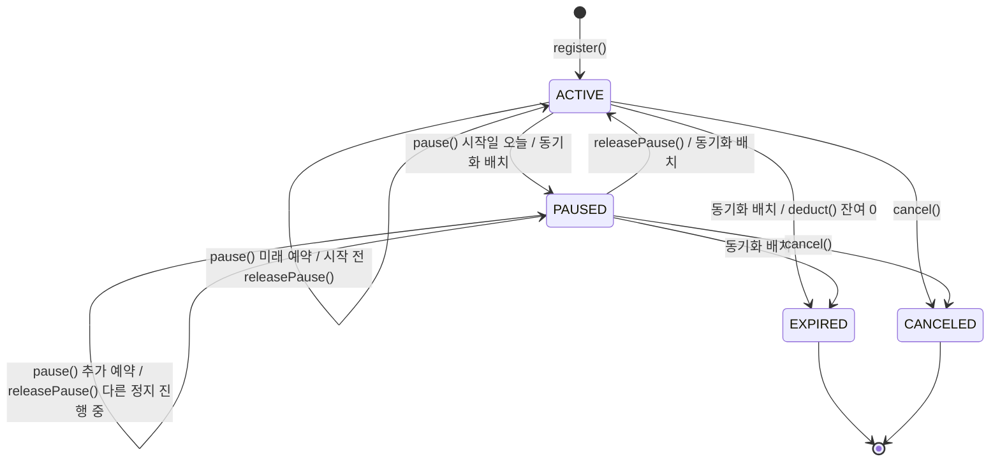
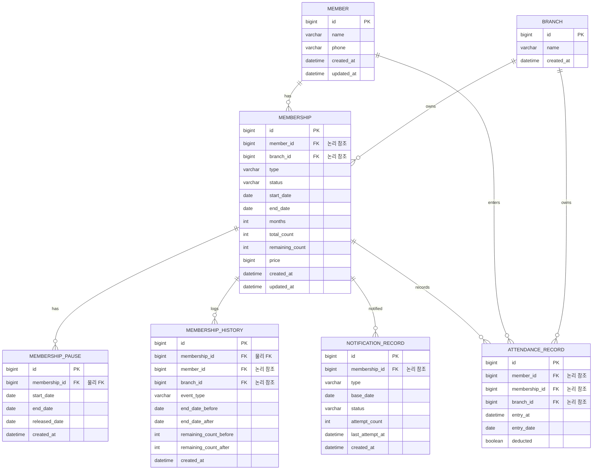
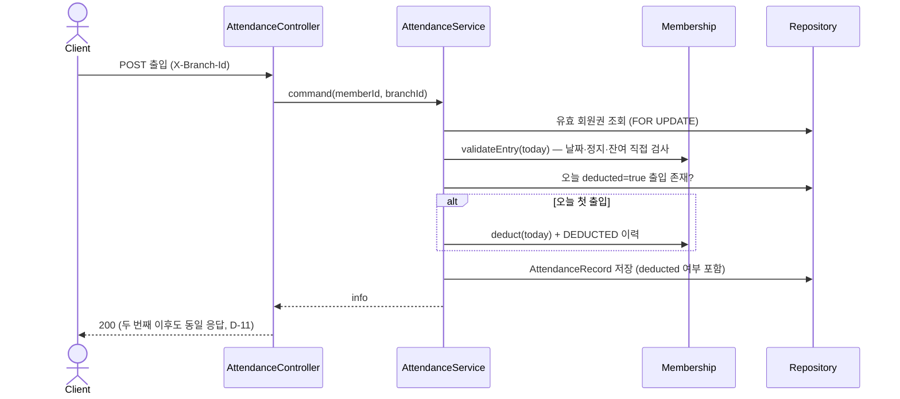

# 도메인 모델링

> 요구사항([02-requirements.md](02-requirements.md))을 옮긴다.
> - 도메인
> - 테이블
> - 동시성 전략
>
> 여기서 정한 이름은 코드에서 **그대로** 쓴다.

---

## 1. 용어 · 네이밍 (고정)

| 비즈니스 용어 | 코드 이름 | 설명 |
|---|---|---|
| 지점 | `Branch` | 테이블 보유, seed로만 생성 (아래 비고) |
| 회원 | `Member` | 전사 공유, 지점 소속 없음 (D-10) |
| 회원권 | `Membership` | 지점 귀속, 상태 컬럼 보유 (D-1 · D-10) |
| 회원권 종류 | `MembershipType` | 기간제 · 횟수제, 종류 추가 가능 구조 (FR-2.4) |
| 정지 | `MembershipPause` | 회원권 하위 엔티티, 예약 · 조기 해제 (D-8) |
| 출입 기록 | `AttendanceRecord` | 지점 귀속 (D-10) |
| 회원권 변경 이력 | `MembershipHistory` | append-only 이벤트 기록 (FR-5.5) |
| 발송 이력 | `NotificationRecord` | 유일 키 (회원권, 종류, 기준일) (D-13) |
| 메시지 발송 | `MessageClient` / `FakeMessageClient` | 외부 연동 인터페이스 · 가짜 구현체 (FR-6.5) |

- 지점 비고 (D-10 구체화)
  - 헤더 `X-Branch-Id`(숫자)는 누락 · 형식 오류 400, 타 지점 데이터 접근 403 (D-10)
  - 존재하지 않는 지점 ID는 404 `BRANCH_NOT_FOUND` (C-20 → D-10 보충)
  - `branch` 테이블은 지점 격리 판정의 기준과 seed 대조 축으로 둔다
  - 지점 등록 · 수정 API는 없다 — seed로만 생성 (README 가정 기재)
  - 200곳 · 회원 10만 명 규모(원문)는 §6 인덱스 근거에만 쓴다

**Enum 값**

| Enum | 값 | 설명 |
|---|---|---|
| `MembershipType` | `PERIOD` / `COUNT` | 기간제 / 횟수제 (FR-2.4, 추가 가능 구조) |
| `MembershipStatus` | `ACTIVE` / `PAUSED` / `EXPIRED` / `CANCELED` | 유효 / 정지 / 만료 / 취소 (D-1, FR-5.2) |
| `MembershipEventType` | `REGISTERED` / `PAUSED` / `RESUMED` / `DEDUCTED` / `CANCELED` | 변경 이력 이벤트 (FR-5.5) |
| `NotificationType` | `EXPIRY_D7` / `EXPIRY_D0` / `REMAINING_3` | 안내 종류 (D-4 · D-13 · D-14) |
| `NotificationStatus` | `SENT` / `FAILED` | 발송 성공 / 실패 (D-3) |

- FR-5.5의 "연장"은 별도 이벤트 타입이 아니다
  - `PAUSED` · `RESUMED` 이벤트의 종료일 before/after 컬럼으로 기록한다
  - TC-4-01의 "정지 등록 시 변경 이력 1건"과 일치시키기 위함이다
- D-3의 "포기 상태"는 별도 enum 값이 아니다
  - `FAILED` + `attemptCount == 3`이 포기 확정이다
  - 재시도 대상 조건이 `attemptCount < 3`이라 자연히 제외된다 (TC-6-05)
- `MessageClient.send(...)`의 반환 타입은 `SendResult(boolean success, String failureReason)`다 (FR-6.5)
  - 발송 실패는 예외가 아니라 반환값(`success=false`)이다
  - 타임아웃은 별도 처리하지 않는다 — 가짜 구현의 지연 상한이 500ms라 배치 직렬 발송 범위에서 수용된다 (02 FR-6.5 상세 정책)
- 에러 코드 접두는 `COMMON_` · `MEMBER_` · `MEMBERSHIP_` · `PAUSE_` · `ATTENDANCE_` · `BRANCH_` (안내 배치는 HTTP 에러 코드 없음, 04 §2)
  - 구체 코드는 [04-api-spec.md](04-api-spec.md)가 정의한다

**식별자 형식**
- 전 테이블 자동 증가 `BIGINT` PK (D-12)
- 별도 표시용 코드 없음

---

## 2. 도메인 분해

| 도메인(패키지) | 애그리거트 루트 | 하위 엔티티 · VO | 책임 | 관련 FR |
|---|---|---|---|---|
| `branch` | `Branch` | — | 지점 존재의 기준 (seed 전용, API 없음) | NFR-1 |
| `member` | `Member` | `Phone` (VO) | 회원 등록 · 수정 · 삭제 | FR-2.1 · FR-7.1~7.3 |
| `membership` | `Membership` | `MembershipPause` · `MembershipHistory`(기록 엔티티) | 등록 · 종료일 계산 · 차감 · 정지 · 연장 · 취소 · 상태 전이 · 상태 동기화 · 변경 이력 | FR-2.2~2.4 · FR-3.3~3.4 · FR-4.1~4.4 · FR-5.5~5.6 · FR-7.4 |
| `attendance` | `AttendanceRecord` | — | 출입 기록 · 출입 가능 판정 흐름 | FR-3.1~3.2 · FR-5.3 |
| `notification` | `NotificationRecord` | `FakeMessageClient`(인프라) | 안내 대상 선정 · 발송 · 재시도 | FR-6.1~6.6 |
| `common` | — | 공유 VO·Enum | ErrorCode · 공통 예외 (지점 헤더 파싱 · 페이지 응답은 `support/web` — domain은 웹 계층을 참조하지 않는다) | NFR-1 · NFR-8 |

- 애그리거트 간에는 객체가 아니라 식별자(`memberId` · `membershipId` · `branchId`)로 참조한다
  - DB에도 물리 FK를 걸지 않는다 (D-25, §6)
- FR-2.4(종류 추가 구조)는 `MembershipType`별 정책(종료일 계산 · 차감 여부)을 enum 메서드로 분리해 충족한다
  - 새 종류 추가 = enum 값과 정책 메서드 구현 추가, 출입 · 안내 · 조회 로직은 수정 없음

---

## 3. 애그리거트 상세

### 3.1 `Branch`

**주요 속성**
- `id`
- `name`

- 행위 없음 — seed로만 생성되고 지점 격리 판정(`branchId` 비교)의 기준이 된다

### 3.2 `Member`

**주요 속성**
- `id`
- `name`
- `phone` (`Phone` VO)

**행위 (도메인 메서드)**

| 메서드 | 하는 일 | 실패 시 | 관련 FR |
|---|---|---|---|
| `create(name, phone)` | 이름 · 연락처 검증 후 생성 | `MEMBER_INVALID_INPUT` 400 (D-22) | FR-2.1 |
| `update(name, phone)` | 이름 · 연락처 수정 | `MEMBER_INVALID_INPUT` 400 (D-22) | FR-7.1 |

**불변식** (서비스의 if문이 아니라 이 애그리거트가 스스로 지킨다)
- 이름은 빈 값이 아니고 50자 이하다 ([04 API-1](04-api-spec.md)과 일치)
- 연락처는 `Phone` 형식(숫자 · 하이픈)을 만족한다 (TC-1-01 · TC-1-02)

### 3.3 `Membership`

**주요 속성**
- `id`
- `memberId` · `branchId`
- `type` (`MembershipType`) · `status` (`MembershipStatus`)
- `startDate` · `endDate`
- `months` (개월 수, NOT NULL — 기간제 = 요청 개월, 횟수제 = 6, D-24)
- `totalCount` · `remainingCount` (횟수제만, 기간제는 null)
- `price`
- `pauses` (`List<MembershipPause>`)

**행위 (도메인 메서드)**

| 메서드 | 하는 일 | 실패 시 | 관련 FR |
|---|---|---|---|
| `register(...)` | 입력 규칙 검사 · 종료일 계산 · `months` 저장 후 ACTIVE 생성 | `MEMBERSHIP_INVALID_INPUT` 400 (D-22 · D-23) | FR-2.2 · FR-2.4 |
| `validateEntry(today)` | 날짜 · 유효 정지 구간 · 잔여를 직접 검사해 출입 가능 판정 | `ATTENDANCE_` 계열 409 | FR-3.2 · FR-4.4 |
| `deduct(today)` | 횟수제 잔여 1 차감 + `DEDUCTED` 이력, 잔여 0 도달 시 EXPIRED 전이 | `MEMBERSHIP_` 계열 4xx | FR-3.3 |
| `pause(startDate, days, today)` | 상한 · 겹침 · 상태 검사 후 정지 등록, 종료일 += days, `PAUSED` 이력, 시작일 = 오늘이면 PAUSED 전이 | `PAUSE_` 계열 4xx | FR-4.1~4.3 |
| `releasePause(pauseId, today)` | 조기 해제, 미사용 일수만큼 종료일 되돌림, `RESUMED` 이력, 상태 재판정(§4) | `PAUSE_` 계열 4xx | FR-4.2 |
| `cancel(today)` | ACTIVE · PAUSED에서만 CANCELED 전이, `CANCELED` 이력 | `MEMBERSHIP_` 계열 4xx | FR-7.4 |

- `register(...)` 종료일 계산
  - 기간제: `plusMonths(개월)` (D-6)
  - 횟수제: `plusMonths(6)` — 6은 `MembershipType` enum 상수 (D-7 보충)
- `register(...)` 입력 규칙 (D-22 · D-23) — 위반은 모두 `MEMBERSHIP_INVALID_INPUT`
  - `type`별 필수 값 누락 (기간제 개월 · 횟수제 횟수)
  - 반대 종류 값 (기간제에 횟수 · 횟수제에 개월)
  - 개월 > 120 · 횟수 > 1000
    - 상한 수치는 `application.yml` 정책 값 — 서비스가 읽어 `register(...)`에 넘긴다 (C-34)
  - 시작일 < 1000-01-01 (C-33)
  - 계산된 종료일 > 9999-12-31

**불변식** (서비스의 if문이 아니라 이 애그리거트가 스스로 지킨다)
- `startDate ≥ 1000-01-01` (D-23, MySQL DATE 보장 범위)
- `endDate ≥ startDate`
- `endDate ≤ 9999-12-31` (D-23)
- 기간(개월)은 1 ~ 120, 횟수는 1 ~ 1000, `price ≥ 0` (FR-2.2 상세 정책 · D-23)
- `months`는 항상 값이 있다 — 기간제 = 요청 개월, 횟수제 = 6 (D-24)
- 기간제는 횟수 값을, 횟수제는 요청 개월 값을 받지 않는다 (D-23)
- 횟수제 `remainingCount ≥ 0`, 기간제는 null
- 정지 횟수 ≤ 3회, 누적 정지 일수 ≤ `months` × 7일, 1회 최소 1일 (D-2 · D-24, 계산 기준은 아래 `MembershipPause`)
- 정지 기간은 서로 겹치지 않는다 (FR-4.1 상세 정책)
  - 겹침은 유효 정지 구간(아래)으로 판정한다
- 정지 시작일은 오늘 이후만 허용한다
- `EXPIRED` · `CANCELED`에서는 차감 · 정지 · 취소가 불가하다 (H-11)
  - 정지 · 취소의 만료 판정은 종료일 < 오늘도 함께 본다 (배치 전 stale 상태 방어, D-21)

`MembershipPause` (하위 엔티티)
- `id` · `startDate` · `endDate`(= 시작일 + 일수 − 1) · `releasedDate`(조기 해제일, null 허용)
- 유효 정지 구간 (C-23 → D-8)
  - 해제되지 않은 정지: `startDate` ~ `endDate` (양끝 포함)
  - 해제된 정지: `startDate` ~ `releasedDate` (해제 당일 포함)
  - 시작 전 해제(`releasedDate < startDate`)는 빈 구간이다
  - `validateEntry(today)`는 today가 어떤 정지의 유효 구간에 들면 `ATTENDANCE_MEMBERSHIP_PAUSED`로 거부한다
    - 조기 해제 당일도 거부되고, 출입은 다음 날부터다 (TC-4-12)
- "오늘을 포함하는 정지" = 유효 정지 구간에 오늘이 드는 정지 (§4 전이 조건에서 쓴다)
- 사용(실제 정지) 일수 = 해제된 정지의 유효 구간 일수 (D-8 · TC-4-07, [04 API-5](04-api-spec.md)와 동일 규칙)
  - 정지 시작 전 해제는 사용 0일
  - 순 연장 = 사용 일수 — 미사용 일수만큼 종료일을 되돌린다
- 상한 계산 기준 (C-24 → D-2)
  - 정지 횟수: 시작 전 해제(사용 0일)한 정지는 세지 않는다 (TC-4-13)
  - 누적 일수: 해제된 정지는 사용 일수로 센다
  - 누적 일수: 해제되지 않은 정지(예약 · 진행 중)는 예정 일수(`startDate` ~ `endDate`)로 센다

`MembershipHistory` (기록 엔티티, append-only)
- `id` · `membershipId` · `memberId` · `branchId` · `eventType` · `endDateBefore` · `endDateAfter` · `remainingCountBefore` · `remainingCountAfter` · `createdAt`
- 등록 · 정지 · 해제 · 차감 · 취소 시 `Membership` 행위 안에서 함께 생성된다 (FR-5.5)

### 3.4 `AttendanceRecord`

**주요 속성**
- `id`
- `memberId` · `membershipId` · `branchId`
- `entryAt` (서버 시각) · `entryDate` (KST 달력일, D-5)
- `deducted` (이 출입에서 차감이 일어났는지)

**행위 (도메인 메서드)**

| 메서드 | 하는 일 | 실패 시 | 관련 FR |
|---|---|---|---|
| `record(...)` | 서버 시각으로 출입 기록 생성 | — | FR-3.1 |

**불변식** (서비스의 if문이 아니라 이 애그리거트가 스스로 지킨다)
- `entryAt`은 서버 시각이다 (클라이언트 입력을 받지 않는다)
- `entryDate` = `entryAt`의 KST 달력일 (하루 1회 판정 기준, D-5)

### 3.5 `NotificationRecord`

**주요 속성**
- `id`
- `membershipId` · `type` (`NotificationType`) · `baseDate` (기준일)
- `status` (`NotificationStatus`) · `attemptCount` · `lastAttemptAt`

**행위 (도메인 메서드)**

| 메서드 | 하는 일 | 실패 시 | 관련 FR |
|---|---|---|---|
| `markSent()` | 발송 성공 기록 | — | FR-6.6 |
| `markFailed()` | 시도 +1 (3회 도달 = 포기 확정) | — | FR-6.4 |

**불변식** (서비스의 if문이 아니라 이 애그리거트가 스스로 지킨다)
- `attemptCount ≤ 3` (D-3)
- (membershipId, type, baseDate)는 유일하다 (D-13 · NFR-7)
- 기준일: `EXPIRY_D7` · `EXPIRY_D0`는 종료일, `REMAINING_3`은 **시작일**
  - 시작일은 불변이라 (회원권, 종류)당 1회가 보장된다 (D-13 한계의 구체화)
  - 종료일을 쓰면 연장 시 기준일이 바뀌어 재발송된다 — `EXPIRY_*`는 이것이 의도된 동작 (D-16)

---

## 4. 상태 전이

`MembershipStatus` (D-1: 상태 컬럼 저장 + 전이 시점 갱신, D-21: 날짜 경과 전이는 00:00 배치)

| 현재 | 다음 | 트리거 | 조건 | 위반 시 |
|---|---|---|---|---|
| — | ACTIVE | `register()` | 회원에 종료일 ≥ 오늘인 `ACTIVE` · `PAUSED` 회원권 없음 (D-15 · D-19) | `MEMBERSHIP_ALREADY_ACTIVE` 409 |
| ACTIVE | PAUSED | `pause()` 시작일 = 오늘 | 상한 · 겹침 통과 (D-2) | `PAUSE_` 계열 4xx |
| ACTIVE | ACTIVE | `pause()` 시작일 > 오늘 (미래 예약) | 상한 · 겹침 통과, 상태 전이 없음 | `PAUSE_` 계열 4xx |
| ACTIVE | ACTIVE | `releasePause()` 시작 전 예약 해제 | 해제 가능한 정지, 상태 전이 없음 | `PAUSE_` 계열 4xx |
| ACTIVE | PAUSED | 상태 동기화 배치 (00:00) | 오늘 시작하는 미해제 정지 있음 (D-21) | — |
| PAUSED | PAUSED | `pause()` 추가 예약 정지 등록 | 기존 정지와 비겹침 + 상한 통과 (D-19), 상태 전이 없음 | `PAUSE_` 계열 4xx |
| PAUSED | PAUSED | `releasePause()` | 해제 대상을 제외한, 오늘을 포함하는 정지가 남음 | `PAUSE_` 계열 4xx |
| PAUSED | ACTIVE | `releasePause()` | 해제 대상을 제외한, 오늘을 포함하는 정지가 없음 | `PAUSE_` 계열 4xx |
| PAUSED | ACTIVE | 상태 동기화 배치 (00:00) | 어제로 끝난 정지만 있고 오늘을 포함하는 정지가 없음 (D-21) | — |
| ACTIVE · PAUSED | EXPIRED | 상태 동기화 배치 (00:00) | 종료일 < 오늘 (D-21) | — |
| ACTIVE | EXPIRED | `deduct()` | 차감으로 잔여 0 도달 | — |
| ACTIVE · PAUSED | CANCELED | `cancel()` | 만료 · 취소 아님 (H-11) | `MEMBERSHIP_` 계열 4xx |

- 구체 에러 코드는 [04-api-spec.md](04-api-spec.md)가 정의한다
- 역전이·종결 상태 재처리는 허용하지 않는다
- "오늘을 포함하는 정지"는 §3.3 `MembershipPause`의 유효 정지 구간 기준이다
- 등록 거부 대상 = 상태 `ACTIVE` · `PAUSED` **그리고** 종료일 ≥ 오늘 (D-15 · D-19 · C-22)
  - 시작일이 미래인 회원권도 포함한다 — 만료 전 미리 재등록은 불가 (D-15 한계)
  - 종료일 < 오늘인 stale `ACTIVE` · `PAUSED`는 세지 않는다 — 배치 전이어도 재등록 가능 (TC-2-10)
- `releasePause()` 직후 상태와 출입
  - 해제 대상 자신은 전이 조건에서 제외하므로, 다른 정지가 없으면 즉시 `ACTIVE`가 된다
  - 해제 당일은 정지 구간에 남으므로(C-23) 상태가 `ACTIVE`여도 그날 출입은 거부된다
  - 출입 판정은 상태가 아니라 유효 정지 구간으로 하기 때문이다
- 날짜 경과 전이는 매일 00:00(KST) 상태 동기화 배치가 처리한다 (D-21 · FR-5.6)
  - 실행 순서: 만료 → 정지 종료 → 정지 시작 (§5 · §7)
  - 각 단계는 현재 상태를 WHERE에 넣은 bulk UPDATE라 다시 실행해도 결과가 같다
  - 배치 전이는 변경 이력을 남기지 않는다 — FR-5.5 이벤트(등록 · 정지 · 해제 · 차감 · 취소)가 아니다
- 배치가 실패한 날의 안전망 — 저장 상태가 하루 어긋나도 규칙은 깨지지 않는다
  - 목록 조회: 종료일 기준 날짜 보정 (D-21, §6 · [04 API-6](04-api-spec.md))
  - 출입 판정(FR-3.2): 상태가 아니라 날짜 · 유효 정지 구간 · 잔여를 직접 검사 (H-10)
  - 정지 · 취소: 종료일 < 오늘이면 만료로 보고 거부 (H-11)
  - 등록: 종료일 조건으로 stale 회원권을 세지 않음
- 차감으로 잔여 0 도달 시 `EXPIRED` 전이는 D-7("만료를 단일 축으로") · H-11("소진 회원권 이벤트 거부")의 구체화다

`NotificationStatus` (표만, 단순 전이)

| 현재 | 다음 | 트리거 | 조건 | 위반 시 |
|---|---|---|---|---|
| — | SENT / FAILED | 첫 발송 시도 | 대상 선정됨 | — |
| FAILED | SENT | 다음 배치 재시도 성공 | `attemptCount < 3` | — |
| FAILED | FAILED | 재시도 실패, 시도 +1 | `attemptCount < 3` | — |

- `attemptCount == 3`인 `FAILED`는 포기 확정 — 재시도 대상에서 제외 (D-3 · TC-6-05)

---

## 5. 도메인 서비스 · 정책

| 이름 | 위치 | 하는 일 | 관련 FR |
|---|---|---|---|
| `MembershipRegistrationService` | `membership` | member 행 락 → 종료일 ≥ 오늘인 `ACTIVE` · `PAUSED` 존재 검사 → 등록 (애그리거트 2개 경유) | FR-2.3 · NFR-3 |
| `AttendanceService` | `attendance` | membership 행 락 → 유효 검사 → 오늘 첫 출입이면 차감 → 기록 (한 트랜잭션) | FR-3.1~3.4 · NFR-2 · NFR-4 |
| `NotificationBatch` | `notification` | 09:00 대상 선정(신규 + 실패 재시도) → 발송 → 이력 기록 | FR-6.1~6.4 |
| `MembershipStatusSyncBatch` | `membership` | 00:00 조건부 bulk UPDATE 3단계 (만료 → 정지 종료 → 정지 시작) | FR-5.6 |
| `MembershipType`별 정책 | `membership` | 종료일 계산(D-6 · D-7) · 차감 대상 여부 분기 (다형성 지점) | FR-2.4 |

- 횟수제 유효기간 6개월은 `MembershipType`의 enum 상수다 (D-7 보충, C-32)
  - `src/main/CLAUDE.md`의 "정책 값은 설정으로" 규칙의 예외다
  - 종류의 정의이고, `months` 컬럼(D-24)에 저장되므로 값이 바뀌어도 기존 회원권에 영향이 없다
- 입력 상한 120 · 1000은 예외가 아니라 설정값이다 (`application.yml` 정책 값, C-34 → D-23)

**`MembershipStatusSyncBatch` 단계** (D-21, 매일 00:00 KST)

| 순서 | 전이 | 대상 조건 | 사용 인덱스 |
|---|---|---|---|
| 1 | `ACTIVE` · `PAUSED` → `EXPIRED` | `status IN ('ACTIVE','PAUSED') AND end_date < :today` | `membership (status, end_date)` 범위 스캔 |
| 2 | `PAUSED` → `ACTIVE` | `status = 'PAUSED'` + 어제로 끝난 정지 있음 + 오늘을 포함하는 정지 없음 | `membership (status, end_date)` 선행 등호 |
| 3 | `ACTIVE` → `PAUSED` | `status = 'ACTIVE'` + `start_date = :today`인 미해제 정지 있음 | `membership_pause (start_date)` |

- 모든 단계의 WHERE에 현재 상태가 들어 있어, 전이된 행은 다음 실행에서 다시 잡히지 않는다 (멱등, TC-5-09)
- 1단계를 먼저 돌려 만료된 회원권을 2 · 3단계 대상에서 뺀다
- JPQL bulk UPDATE는 엔티티를 거치지 않으므로 `MembershipHistory`가 생기지 않는다 (§4)

---

## 6. ERD

- 참조 구분 (D-25): 애그리거트 간 참조(`"논리 참조"`)는 물리 FK 없이 식별자만 두고, 같은 애그리거트 안의 참조(`"물리 FK"` — `membership_pause` · `membership_history`의 `membership_id`)만 JPA 연관으로 물리 FK가 생긴다
- `membership.months` = 개월 수 (기간제 = 요청 개월, 횟수제 = 6) — 정지 누적 상한 계산에 쓴다 (D-24 · D-2)
- `membership.price` = API 표면의 `paymentAmount` ([04 API-2](04-api-spec.md)) — DB · 도메인은 `price`, 요청 · 응답 필드는 `paymentAmount`로 고정

**제약 · 인덱스**

| 테이블 | 종류 | 컬럼 | 이유 |
|---|---|---|---|
| `notification_record` | UNIQUE | `(membership_id, type, base_date)` | 중복 발송 방지 · 배치 멱등 (D-13 · NFR-7) |
| `membership` | INDEX | `(branch_id, status, end_date)` | 목록 상태 필터 + 만료 임박 정렬 (FR-5.2 · NFR-5) |
| `membership` | INDEX | `(branch_id, end_date)` | 필터 없는 목록 정렬 (TC-5-02 · NFR-5) |
| `membership` | INDEX | `(member_id, status)` | 등록 거부 검사 · 출입 판정 대상 조회 (FR-2.3 · FR-3.2) |
| `membership` | INDEX | `(status, end_date)` | 배치 만료 안내 대상 선정 · 상태 동기화 배치 (FR-6.1 · FR-5.6) |
| `membership_pause` | INDEX | `(start_date)` | 상태 동기화 배치의 오늘 시작 정지 조회 (FR-5.6) |
| `membership_pause` | INDEX | `(membership_id)` | 회원권별 정지 조회 · 겹침 · 상한 검사 (FR-4.1 · FR-4.3) |
| `attendance_record` | INDEX | `(membership_id, entry_date)` | 하루 1회 차감 판정 (락 트랜잭션 내 조회, NFR-2) |
| `attendance_record` | INDEX | `(member_id, branch_id, entry_at)` | 지점 귀속 출입 이력 최신순 조회 (FR-5.3 · NFR-1) |
| `membership_history` | INDEX | `(member_id, branch_id, created_at)` | 지점 귀속 변경 이력 최신순 조회 (FR-5.4 · NFR-1) |
| `notification_record` | INDEX | `(status, attempt_count)` | 실패 건(`FAILED`, 시도<3) 재시도 대상 조회 (FR-6.4) |
| `member` | NOT NULL | `name` · `phone` | FR-2.1 필수 입력 |
| `membership` | NOT NULL | `member_id` · `branch_id` · `type` · `status` · `start_date` · `end_date` · `months` · `price` | 유효 판정 · 지점 격리 · 정지 상한의 기준 컬럼 (D-24) |
| `attendance_record` | NOT NULL | 전 컬럼 | 이력 무결성 (FR-3.1) |
| `membership_history` | NOT NULL | `membership_id` · `member_id` · `branch_id` · `event_type` · `created_at` | 이력 무결성 · 지점 귀속 조회 (FR-5.5) |
| `member` | UNIQUE(F7 구현 시) | `phone` | 연락처 중복 거부 (FR-7.3) — F7 착수 전에는 걸지 않는다 |

**인덱스 설계 근거 (목록 조회 실행 계획 대비, NFR-5 · TC-5-05)**

- 규모 전제: 지점 200곳 · 회원 10만 명 (원문) — 지점당 평균 수백 건이라도 전체 테이블은 10만 행 이상, 풀 스캔 불가
- 상태 필터는 날짜 보정을 포함한다 (D-21, [04 API-6](04-api-spec.md))
- `ACTIVE` · `PAUSED` 필터: `WHERE branch_id = ? AND status = ? AND end_date >= :today ORDER BY end_date ASC LIMIT ?, ?`
  - `(branch_id, status, end_date)`: 등호 조건 2개를 선행 컬럼으로, 범위 · 정렬 키를 후행 컬럼으로
  - 기대 실행 계획: `type=range`, `Extra`에 `Using filesort` 없음 (범위 스캔이 곧 종료일 순서)
  - 보정 조건 `end_date >= :today`가 인덱스 세 번째 컬럼의 범위 조건이라 스캔 범위를 오히려 줄인다
- `EXPIRED` 필터: `WHERE branch_id = ? AND (status = 'EXPIRED' OR (status IN ('ACTIVE','PAUSED') AND end_date < :today))`
  - 같은 인덱스의 범위 3개(`EXPIRED` 전체, `ACTIVE`의 과거 종료일, `PAUSED`의 과거 종료일) 합집합으로 읽을 수 있다 (`type=range`)
  - 한계: 범위가 여러 개라 종료일 정렬을 인덱스 순서로 해소하지 못해 `Using filesort`가 생길 수 있다
  - 한계: OR 조건은 옵티마이저가 `(branch_id, end_date)` 스캔을 고를 수도 있어, 실제 계획은 EXPLAIN으로 확인한다 (TC-5-05)
  - 00:00 배치가 기본 정합을 맞추므로 `ACTIVE` · `PAUSED`의 과거 종료일 범위는 평소 비어 있다
  - 즉 보정 분기는 배치가 실패한 날의 안전망이고, 평소 읽는 양은 `status = 'EXPIRED'` 범위와 같다
- 필터 없는 목록: `WHERE branch_id = ? ORDER BY end_date ASC`
  - 위 인덱스로는 status가 끼어 정렬을 못 타므로 `(branch_id, end_date)`를 별도로 둔다
  - 응답 상태 보정(종료일 < 오늘 → `EXPIRED`)은 SELECT 절 계산이라 인덱스 선택에 영향이 없다
- 깊은 offset의 스캔 비용은 D-12 한계 — 개선 방향(커서)을 README에 기재
- EXPLAIN은 대량 seed(§9 비고) 위에서 떠서 README 검증 결과로 첨부한다 (TC-5-05 · SUB-8)

---

## 7. 동시성 · 정합성 지점

| 지점 | 경합 시나리오 | 제어 방식 | 트랜잭션 경계 | 검증 |
|---|---|---|---|---|
| 출입 차감 (KST 하루 1회, D-5) | 같은 회원 출입 요청 N건 동시 (S-37) | membership 행 비관적 락(PK `FOR UPDATE`) → `attendance_record`에서 오늘(`entry_date`) `deducted=true` 존재 검사 → 첫 출입만 차감 | 출입 API 1건 = 1트랜잭션 (기록 + 차감 원자, NFR-4) | TC-3-07 (NFR-2) |
| 회원권 등록 | 같은 회원에 등록 요청 2건 동시 | member 행 비관적 락(PK `FOR UPDATE`)으로 직렬화 → 종료일 ≥ 오늘인 `ACTIVE` · `PAUSED` 존재 검사 → 삽입 | 등록 API 1건 = 1트랜잭션 | TC-2-06 (NFR-3) |
| 안내 발송 | 배치 재실행 · 중복 실행 | `notification_record` UNIQUE `(membership_id, type, base_date)` — 삽입 충돌 시 해당 건 스킵 | 발송 1건 = 이력 1건 커밋 (건별 트랜잭션) | TC-6-04 (NFR-7) |
| 상태 동기화 (00:00, D-21) | 배치 재실행 · 같은 회원권의 정지 · 해제 · 출입과 동시 | 현재 상태를 WHERE에 넣은 조건부 bulk UPDATE — InnoDB가 조건에 맞는 행만 쓰기 잠금 | 단계 1개 = UPDATE 1문 = 1트랜잭션 (§5 순서) | TC-5-06 · TC-5-07 · TC-5-09 |

**선택 근거**
- "유효 회원권 1개"는 상태 · 날짜 조건부 제약이라 MySQL UNIQUE로 표현할 수 없다
  - 부모(member) 행 락으로 검사-삽입 구간을 직렬화한다 — 이것이 02의 "DB 수준 방어"다
  - 락 조회를 트랜잭션의 첫 쿼리로 둔다. REPEATABLE READ 스냅샷이 첫 일반 조회 시점에 잡히므로, 락 앞에 일반 SELECT가 있으면 먼저 커밋된 등록을 못 본다.
- 차감 판정도 조건부(오늘 첫 출입)라 조건부 UPDATE보다 락 + 검사가 단순하다
  - 두 락 모두 PK 등호 조회라 잠금 범위가 1행이다 (인덱스 필수 조건 충족)
- 출입 판정 대상 회원권은 항상 1건 이하다
  - 조회 조건 = `member_id = ? AND status IN ('ACTIVE','PAUSED') AND end_date >= :today`
  - 등록 규칙(C-22 → D-15)이 이 조건에 맞는 회원권을 회원당 1건으로 제한한다
  - 그래서 "어느 회원권으로 판정 · 차감할지" 고르는 규칙이 필요 없고, 락 대상도 1행이다
- 정지 · 해제 · 취소도 같은 membership 행 락을 공유해 상한 검사 경합을 직렬화한다
- 상태 동기화 배치는 행 락을 먼저 잡지 않는다
  - bulk UPDATE는 최신 커밋 행을 다시 읽고 WHERE를 평가하므로, 정지 · 해제가 먼저 커밋되면 그 결과를 기준으로 전이한다
  - 정지 · 해제 트랜잭션이 행 락을 쥐고 있으면 해당 행에서 대기한다 — 00:00은 출입 저부하 시간대다
  - 대상 선정은 `(status, end_date)` · `membership_pause (start_date)` 인덱스 범위라 잠금 범위도 대상 행으로 좁다
- 배치는 단일 인스턴스 전제(02 §1 범위 밖)
  - 안내 배치는 유일 키가 최후 방어선이다
  - 상태 동기화 배치는 조건부 UPDATE라 두 번 실행돼도 결과가 같다
- 외부 발송(지연 100~500ms)은 트랜잭션 밖에서 호출하고, 결과 기록만 짧은 트랜잭션으로 커밋한다

---

## 8. 핵심 흐름 (선택)

출입 + 하루 1회 차감 (락 · 트랜잭션 · 기록이 얽히는 유일한 흐름)

---

## 9. 기초 데이터 (seed)

원문에 기초 데이터 표는 **없다** (규모 문장 "지점 200곳, 회원 10만 명"만 존재). 아래는 NFR-6(compose에 seed 포함) 근거의 시연용 최소 구성이다 — README 가정 기재.

- 테이블별 seed 투입 시점: F1 `branch` (task_list T1-3) / F2 `member` · `membership` (task_list T2-1)

| 테이블 | 원문 행 수 | data.sql 행 수 | 대조 완료 |
|---|---|---|---|
| `branch` | (원문 표 없음) | 2 | [x] |
| `member` | (원문 표 없음) | 4 | [x] |
| `membership` | (원문 표 없음) | 4 | [x] |

**data.sql 구성 (데모 시나리오용)**

| 행 | 내용 | 쓰이는 곳 |
|---|---|---|
| branch 1~2 | 지점 이름만 (`강남점` · `잠실점`) | 헤더 식별 · 지점 격리 데모 |
| member 1~4 | 이름 · 연락처만 (전사 공유, D-10) | 등록 · 출입 데모 |
| membership 1 | 회원 1 · 지점 1 · 기간제 · `months` 12 · ACTIVE | 출입 · 목록 데모 |
| membership 2 | 회원 2 · 지점 1 · 횟수제(잔여 10) · `months` 6 · ACTIVE | 차감 데모 |
| membership 3 | 회원 3 · 지점 1 · 기간제 · `months` 3 · EXPIRED | 상태 필터 · 출입 거부 데모 |
| membership 4 | 회원 4 · 지점 2 · 기간제 · `months` 12 · ACTIVE | 지점 격리(403) 데모 |

- 회원 배정은 1인 1 유효권(FR-2.3 · D-15 · D-19)을 지킨다
  - 종료일 ≥ 오늘인 `ACTIVE` · `PAUSED` 회원권은 회원당 최대 1건 (회원 1 · 2 · 4가 각 1건)
  - 회원 3은 `EXPIRED`만 보유 — 유효권 없음이라 위반이 아니다
- `ACTIVE` seed의 종료일은 평가 시점보다 충분히 뒤로 잡는다
  - 종료일이 지나면 00:00 상태 동기화 배치(D-21)가 `EXPIRED`로 바꿔 데모가 깨진다

- `membership_history`의 등록 이벤트는 seed로 넣지 않는다 (seed 한계, README 기재)
- EXPLAIN 검증용 대량 데이터(membership 10만 행)는 `data.sql`이 아니라 별도 스크립트 · 테스트 fixture로 생성한다 (TC-5-05)
